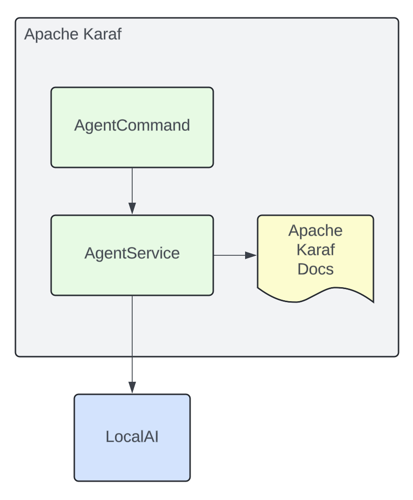
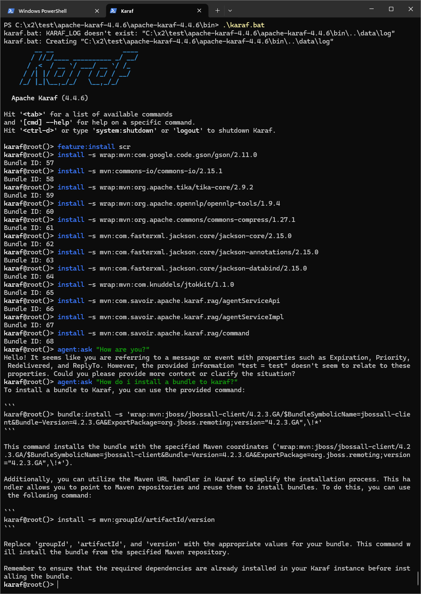
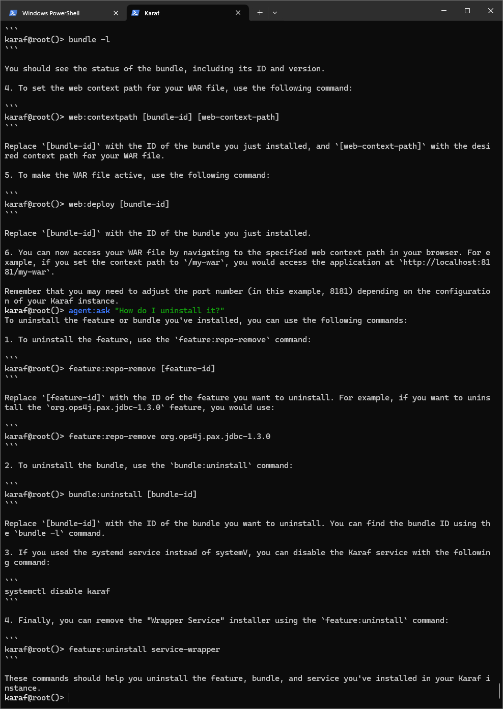

In this demo we’re going to explore learning Retrieval-Augmented
Generation with LangChain4j and LocalAI.

<figure>

</figure>

# What is Retrieval-Augmented Generation?

Retrieval-Augmented Generation is an architectural approach to pulling
in your data as context for large language models in order to improve
relevancy.

# How are we going to use it in Apache Karaf?

<figure>

</figure>

What this will allow the user to do is ask our agent questions from the
Apache Karaf console.

<figure>

</figure>

<figure>

</figure>

<figure>

</figure>

# Build and run the demo

Build:

``` bash
mvn install
```

Installation:

``` bash
feature:install scr
install -s wrap:mvn:com.google.code.gson/gson/2.11.0
install -s mvn:commons-io/commons-io/2.15.1
install -s wrap:mvn:org.apache.tika/tika-core/2.9.2
install -s wrap:mvn:org.apache.opennlp/opennlp-tools/1.9.4
install -s wrap:mvn:org.apache.commons/commons-compress/1.27.1
install -s mvn:com.fasterxml.jackson.core/jackson-core/2.15.0
install -s mvn:com.fasterxml.jackson.core/jackson-annotations/2.15.0
install -s mvn:com.fasterxml.jackson.core/jackson-databind/2.15.0
install -s wrap:mvn:com.knuddels/jtokkit/1.1.0
install -s mvn:com.savoir.apache.karaf.rag/agentServiceApi
install -s mvn:com.savoir.apache.karaf.rag/agentServiceImpl
install -s mvn:com.savoir.apache.karaf.rag/command
```

Run LocalAI via Docker on Windows x86_64:

``` bash
docker run -p 8080:8080 --name local-ai -ti localai/localai:latest-aio-cpu
docker run --rm -d -p 8080:8080 --gpus all --name local-ai -ti localai/localai:latest-aio-gpu-nvidia-cuda-11
```

Note:

Error gRPC service was encountered when running LocalAI docker image on
Apple Silicon.

Ran both Apache Karaf and LocalAI on the same host for successful demo
run.

# Future Work

# Conclusions

# About the Authors

[Jamie
Goodyear](https://github.com/savoirtech/blogs/blob/main/authors/JamieGoodyear.md)

# Reaching Out

Please do not hesitate to reach out with questions and comments, here on
the Blog, or through the Savoir Technologies website at
<https://www.savoirtech.com>.

# With Thanks

Thank you to the Apache Karaf, and LangChain4J communities.

\(c\) 2024 Savoir Technologies
