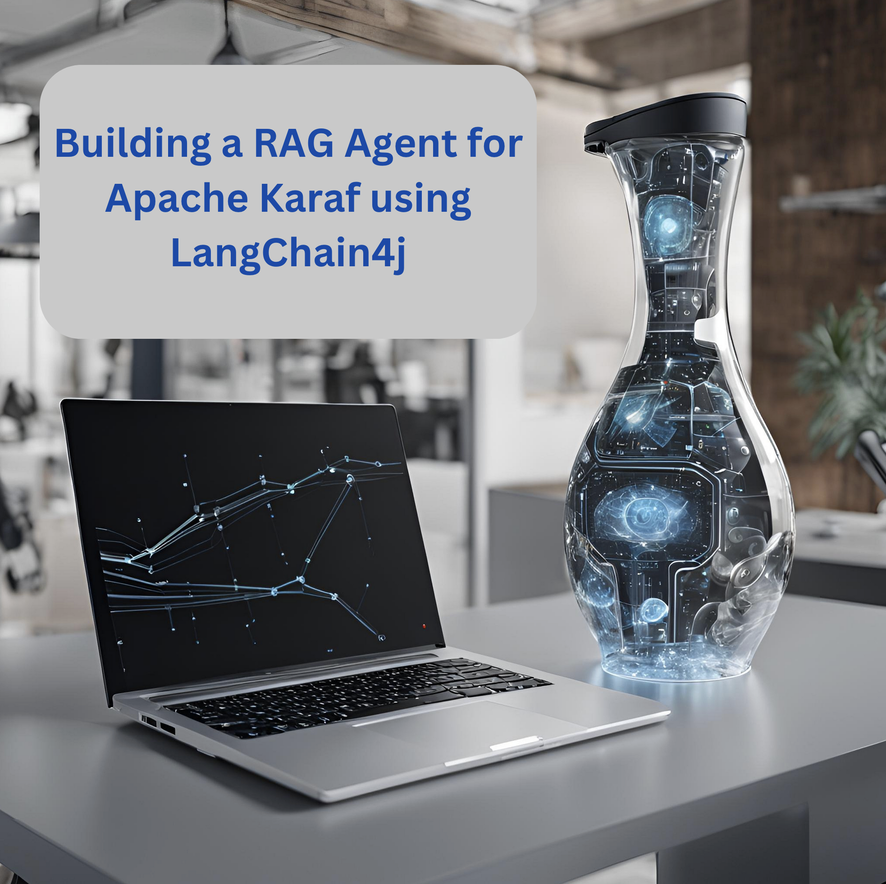
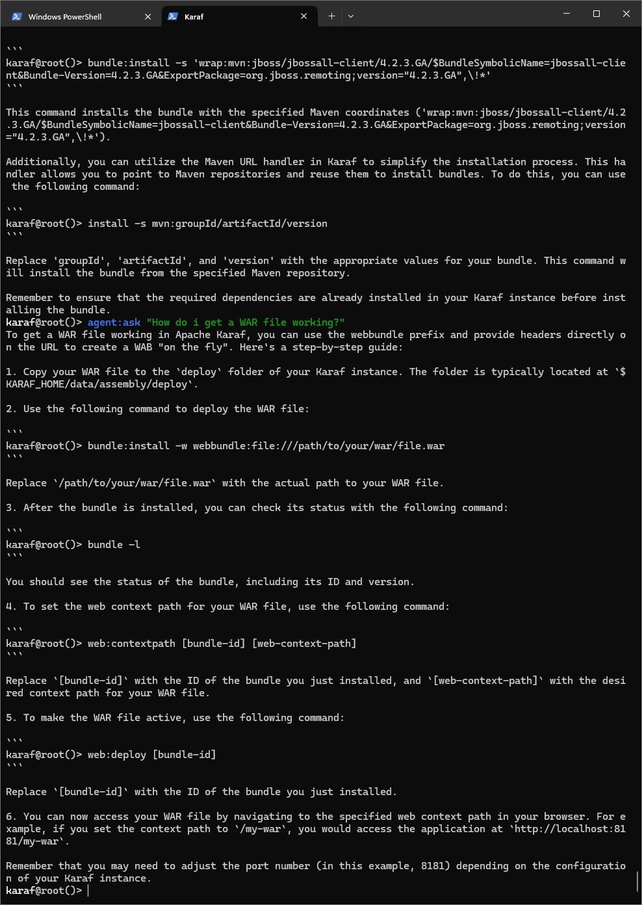

In this demo we’re going to explore learning Retrieval-Augmented
Generation with LangChain4j and LocalAI.

<figure>

</figure>

# What is Retrieval-Augmented Generation?

Retrieval-Augmented Generation is an architectural approach to pulling
in your data as context for large language models in order to improve
relevancy.

# How are we going to use it in Apache Karaf?

The [LangChain4j
community](https://github.com/langchain4j/langchain4j-examples/blob/main/rag-examples/src/main/java/_3_advanced/_01_Advanced_RAG_with_Query_Compression_Example.java)
has provided a simple introduction to this pattern, we will apply our
learning from their sample into the basis of an Apache Karaf expert
agent which users can ask questions from Apache Karaf’s console.

<figure>

</figure>

Once we’re integrated LangChain4j RAG into a Karaf Assistant, and have
it consume Apache Karaf’s user documentation, we’ll teat out its
knowledge in conversation.

<figure>

</figure>

<figure>

</figure>

<figure>

</figure>

# Build and run the demo

For our demo you’ll need to source Java 11 or above.

Build:

``` bash
mvn clean install
```

Installation in Apache Karaf 4.4.6:

``` bash
feature:install scr
install -s wrap:mvn:com.google.code.gson/gson/2.11.0
install -s mvn:commons-io/commons-io/2.15.1
install -s wrap:mvn:org.apache.tika/tika-core/2.9.2
install -s wrap:mvn:org.apache.opennlp/opennlp-tools/1.9.4
install -s wrap:mvn:org.apache.commons/commons-compress/1.27.1
install -s mvn:com.fasterxml.jackson.core/jackson-core/2.15.0
install -s mvn:com.fasterxml.jackson.core/jackson-annotations/2.15.0
install -s mvn:com.fasterxml.jackson.core/jackson-databind/2.15.0
install -s wrap:mvn:com.knuddels/jtokkit/1.1.0
install -s mvn:com.savoir.apache.karaf.rag/agentServiceApi
install -s mvn:com.savoir.apache.karaf.rag/agentServiceImpl
install -s mvn:com.savoir.apache.karaf.rag/command
```

LocalAI will need to be running before it can process user requests. In
our demo we use a docker image with support for NVidia GPU.

Run LocalAI via Docker on Windows x86_64:

``` bash
docker run -p 8080:8080 --name local-ai -ti localai/localai:latest-aio-cpu
docker run --rm -d -p 8080:8080 --gpus all --name local-ai -ti localai/localai:latest-aio-gpu-nvidia-cuda-11
```

Note:

Error gRPC service was encountered when running LocalAI docker image on
Apple Silicon.

Ran both Apache Karaf and LocalAI on the same host for successful demo
run.

# Future Work

LangChain4J embedding jar, and its dependencies are not OSGi ready
out-of-the-box, we can consider helping those libraries to make OSGi
friendly releases.

If its not possible to update those libraries to be more OSGi friendly,
then we need to consider other JVMs to run the RAG service, then
integrate to them.

Its possible that [Apache Karaf
Minho](https://github.com/apache/karaf-minho) may provide a future Karaf
style experience with better support for non-OSGi workflows.

This demo project only starts to scratch the surface of RAG patterns, we
intend to explore more of them in future posts.

# Conclusions

The included demo to this article is NOT production code. We implemented
replacement classes where possible to allow Classpath resource access in
an OSGi environment.

The concepts for ingesting a document, and setting up
Retrieval-Augmented Generation architecture ARE worth investigating.

# About the Authors

[Jamie
Goodyear](https://github.com/savoirtech/blogs/blob/main/authors/JamieGoodyear.md)

# Reaching Out

Please do not hesitate to reach out with questions and comments, here on
the Blog, or through the Savoir Technologies website at
<https://www.savoirtech.com>.

# With Thanks

Thank you to the Apache Karaf, and LangChain4J communities.

\(c\) 2024 Savoir Technologies
