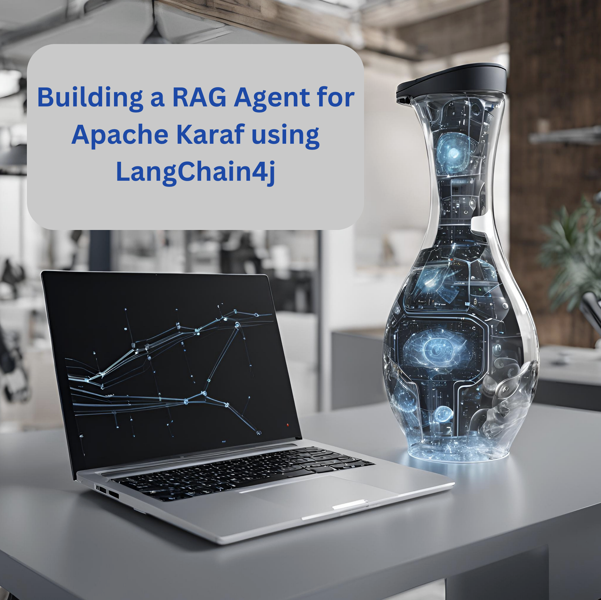
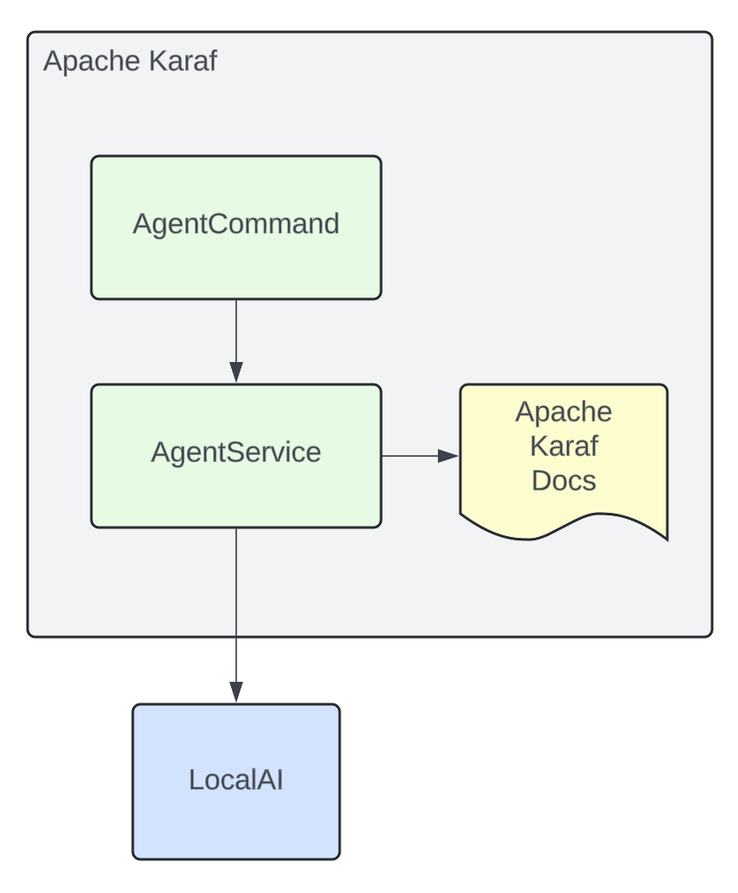
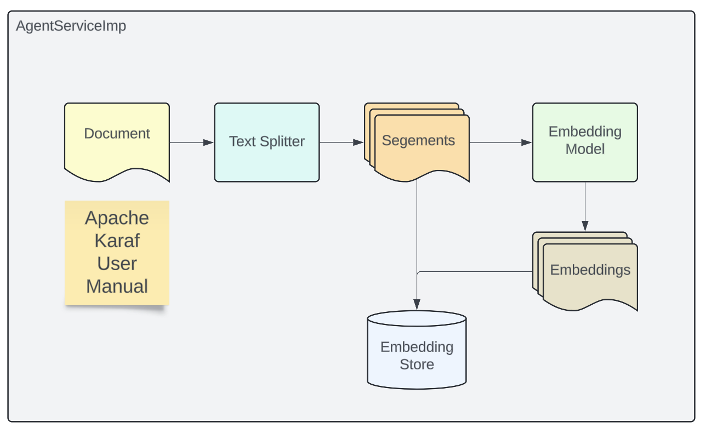
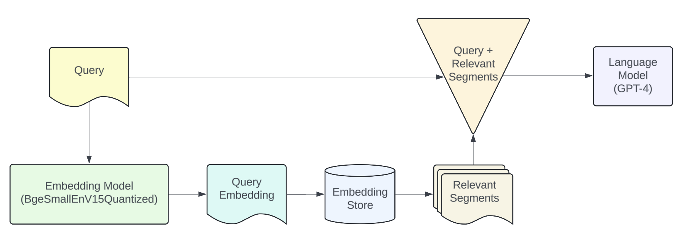
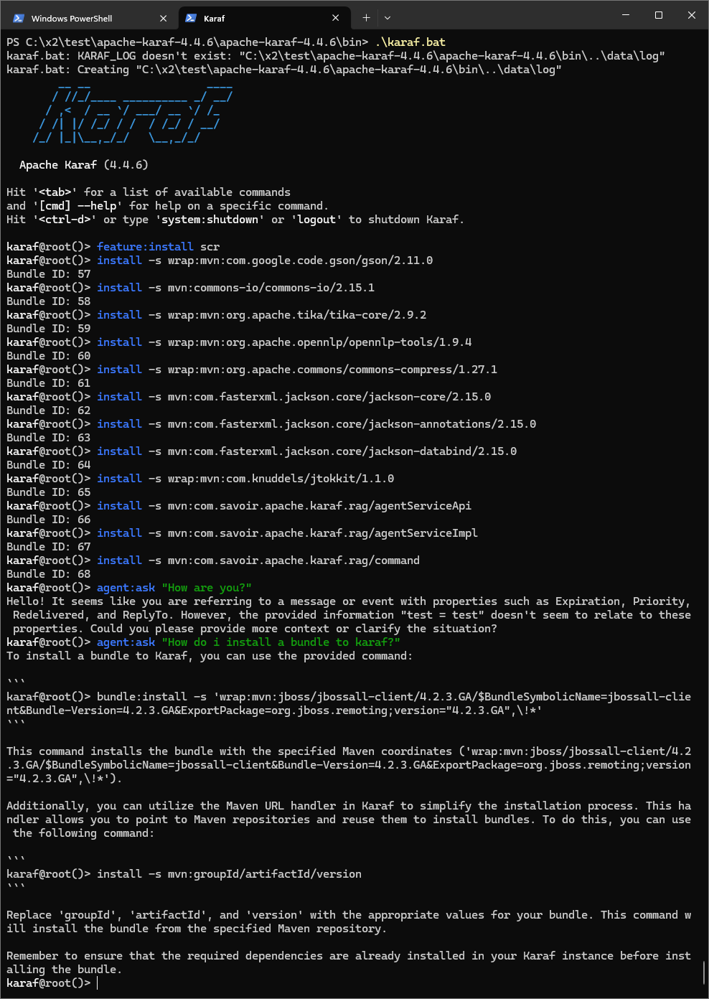
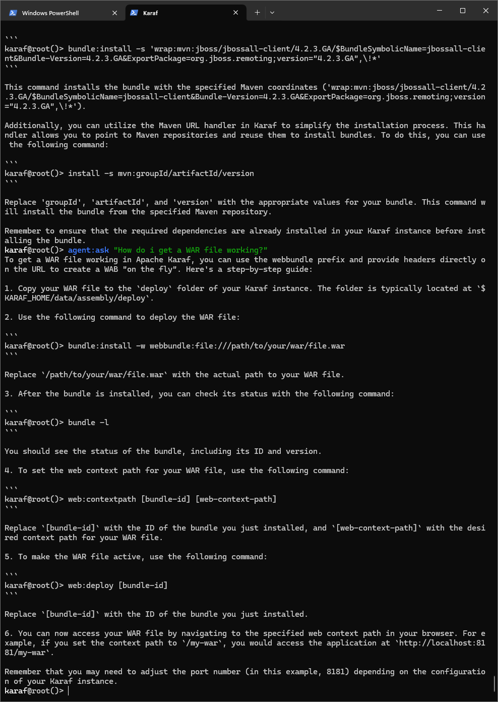
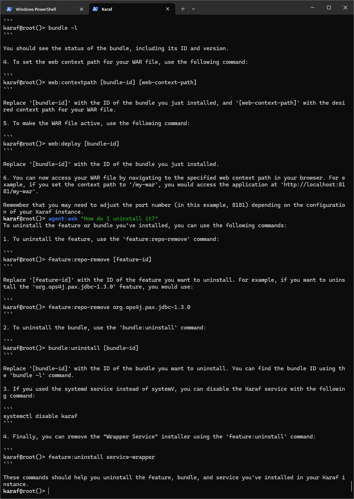

= Apache Karaf Learning RAG

In this demo we're going to explore learning Retrieval-Augmented Generation with LangChain4j and LocalAI.

== What is Retrieval-Augmented Generation?

Retrieval-Augmented Generation is an architectural approach to pulling in your data as context for large language models in order to improve relevancy.

== How are we going to use it in Apache Karaf?

The https://github.com/langchain4j/langchain4j-examples/blob/main/rag-examples/src/main/java/_3_advanced/_01_Advanced_RAG_with_Query_Compression_Example.java[LangChain4j community] has provided a simple introduction to this pattern, we will apply our learning from their sample into the basis of an Apache Karaf expert agent which users can ask questions from Apache Karaf's console.

Once we're integrated LangChain4j RAG into a Karaf Assistant, and have it consume Apache Karaf's user documentation, we'll test out its knowledge in conversation.

=== The Process

The approach is broken into two stages; indexing and retrieval.

==== Stage 1: Indexing

During the indexing stage, documents are processed in a way to make them efficient to search during retrieval stage.

The document embedding pipeline created is illustrated above, and implemented below:

[,java.num]
----
//Document to read.
Document document = loadDocument(toPath(documentPath), new TextDocumentParser());

//Embedding Model
EmbeddingModel embeddingModel = new OSGiSafeBgeSmallEnV15QuantizedEmbeddingModel();

//Embedding Store
EmbeddingStore<TextSegment> embeddingStore = new InMemoryEmbeddingStore<>();

//How to consume our document
EmbeddingStoreIngestor ingestor = EmbeddingStoreIngestor.builder()
    .documentSplitter(DocumentSplitters.recursive(300, 0))
    .embeddingModel(embeddingModel)
    .embeddingStore(embeddingStore)
    .build();

//Consume document
ingestor.ingest(document);
----

==== Stage 2: Retrieval

During Retrieval stage we handle the case of when a user submits a question that will be answered via our indexed documents.

The above diagram illustrates the general pipeline a query takes towards being matched to appropriate segments for LLM processing.

Below we implement query compression, we use this technique when we expect queries to refer back to earlier parts of a conversation.

ie. "How do we install a WAR to Karaf?", then "How do we uninstall it?" -- "it" being the WAR.

The process sees the query, and relevant segments being passed to the LLM as a single query.

[,java.num]
----
//Query Compression
QueryTransformer queryTransformer = new CompressingQueryTransformer(chatLanguageModel);

//How to retrieve our embedded document
ContentRetriever contentRetriever = EmbeddingStoreContentRetriever.builder()
    .embeddingStore(embeddingStore)
    .embeddingModel(embeddingModel)
    .maxResults(2)
    .minScore(0.6)
    .build();

//Query Transformer for given Chat Model and Embedding Store combine to perform Retrieval Augmentation.
RetrievalAugmentor retrievalAugmentor = DefaultRetrievalAugmentor.builder()
    .queryTransformer(queryTransformer)
    .contentRetriever(contentRetriever)
    .build();

//Build our RAG KarafAssistant
return AiServices.builder(KarafAssistant.class)
    .chatLanguageModel(chatLanguageModel)
    .retrievalAugmentor(retrievalAugmentor)
    .chatMemory(MessageWindowChatMemory.withMaxMessages(10))
    .build();
----

== How are we going to use it in Apache Karaf?

The https://github.com/langchain4j/langchain4j-examples/blob/main/rag-examples/src/main/java/_3_advanced/_01_Advanced_RAG_with_Query_Compression_Example.java[LangChain4j community] has provided a simple introduction to this pattern, we will apply our learning from their sample into the basis of an Apache Karaf expert agent which users can ask questions from Apache Karaf's console.

Once we're integrated LangChain4j RAG into a Karaf Assistant, and have it consume Apache Karaf's user documentation, we'll teat out its knowledge in conversation.

== Build and run the demo

For our demo you'll need to source Java 11 or above.

Build:
[,bash,num]
----
mvn clean install
----

Installation in Apache Karaf 4.4.6:
[,bash,num]
----
feature:install scr
install -s wrap:mvn:com.google.code.gson/gson/2.11.0
install -s mvn:commons-io/commons-io/2.15.1
install -s wrap:mvn:org.apache.tika/tika-core/2.9.2
install -s wrap:mvn:org.apache.opennlp/opennlp-tools/1.9.4
install -s wrap:mvn:org.apache.commons/commons-compress/1.27.1
install -s mvn:com.fasterxml.jackson.core/jackson-core/2.15.0
install -s mvn:com.fasterxml.jackson.core/jackson-annotations/2.15.0
install -s mvn:com.fasterxml.jackson.core/jackson-databind/2.15.0
install -s wrap:mvn:com.knuddels/jtokkit/1.1.0
install -s mvn:com.savoir.apache.karaf.rag/agentServiceApi
install -s mvn:com.savoir.apache.karaf.rag/agentServiceImpl
install -s mvn:com.savoir.apache.karaf.rag/command
----

LocalAI will need to be running before it can process user requests.
In our demo we use a docker image with support for NVidia GPU.

Run LocalAI via Docker on Windows x86_64:
[,bash,num]
----
docker run -p 8080:8080 --name local-ai -ti localai/localai:latest-aio-cpu
docker run --rm -d -p 8080:8080 --gpus all --name local-ai -ti localai/localai:latest-aio-gpu-nvidia-cuda-11
----

Note:

Error gRPC service was encountered when running LocalAI docker image on Apple Silicon.

Ran both Apache Karaf and LocalAI on the same host for successful demo run.

=== The Result:

== Future Work

LangChain4J embedding jar, and its dependencies are not OSGi ready out-of-the-box, we can consider helping those libraries to make OSGi friendly releases. If its not possible to update those libraries to be more OSGi friendly, then we need to consider other JVMs to run the Embedding process, then integrate to the populated Embedding store. I will note that its is possible that https://github.com/apache/karaf-minho[Apache Karaf Minho] may provide a future Karaf style experience with better support for non-OSGi workflows.

== Conclusions

The included demo to this article is NOT production code. We implemented replacement classes where possible to allow Classpath resource access in an OSGi environment for the embedding process.

The concepts for ingesting a document, and setting up Retrieval-Augmented Generation architecture ARE worth investigating.

We plan to delve into more samples of RAF architecture, using Apache projects.

== About the Authors

link:https://github.com/savoirtech/blogs/blob/main/authors/JamieGoodyear.md[Jamie Goodyear]

== Reaching Out

Please do not hesitate to reach out with questions and comments, here on the Blog, or through the Savoir Technologies website at https://www.savoirtech.com.

== With Thanks

Thank you to the Apache Karaf, and LangChain4J communities.

(c) 2024 Savoir Technologies
